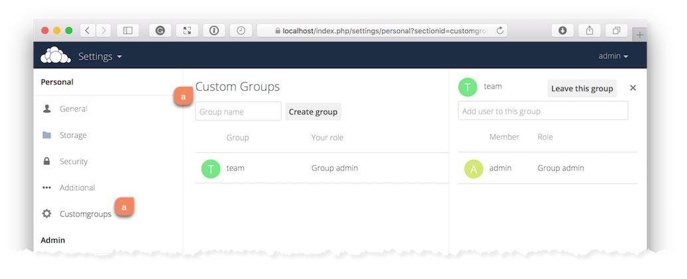
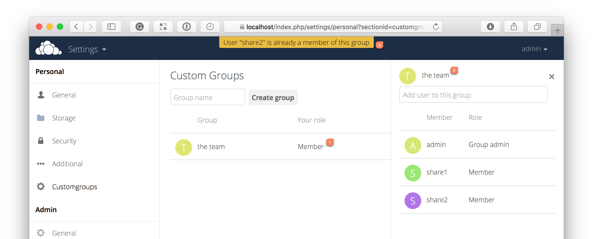
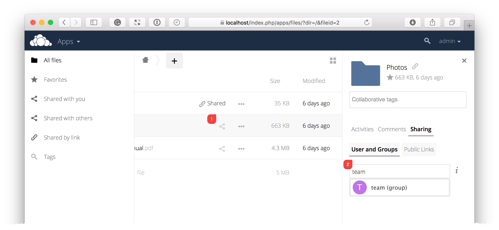
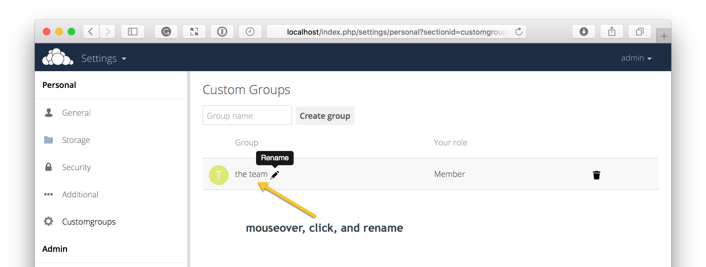

=============
Custom Groups
=============

In previous versions of ownCloud, if you wanted to share a file or a folder with more than one person, you had to share it  either with many people individually, or share to one or more groups. 
However, you could only share with groups which your ownCloud administrator had already created. 

This wasn't the most efficient way to work. 
To address that, as of ownCloud 10.0, you can now create your own groups on-the-fly, through a feature called "Custom Groups". 
Here's how to use it. 

.. note::
	Depending on your Custom Groups setting, configured by the ownCloud admin, Custom Groups may behave differently
	- Creating or renaming a Custom Group using an existing name of another Custom Group can be allowed or not depending on administrative settings.
	- Custom Group creation can be limited to ownCloud **group admins**

Creating Custom Groups
~~~~~~~~~~~~~~~~~~~~~~

Assuming that your ownCloud administrator's already `enabled custom groups`_; under the admin menu, in the top right-hand corner, click "**Settings**" (1).
Then, in the main menu on the settings page, in "**Personal**" section, click the option: "**Customgroups**" (2).
This will take you to the "**Custom Groups**" admin page. 

To create a new custom group, in the text field at the top where you see the placeholder text: "**Group name**", add the group name and click "**Create group**".
After a moment or two, you’ll see the new custom group appear in the groups list.

.. note::
   Please be aware of two things: 1) Custom groups are visible **only** to members of the group, but **not** to anyone outside the group and 2) ownCloud administrators can see and modify all custom groups of an instance.

Managing Group Members
~~~~~~~~~~~~~~~~~~~~~~

To add or remove users in a custom group, click your role (1), which will likely be "**Member**" (at least at first), and you'll see a panel appear on the right-hand side listing the group's users and their roles. 
In the "**Add user to this group field**" at the top of the panel (2), start typing the name of the user that you want to add. 

After a moment or two, you'll see a list of users that match what you've typed appear (if there are any) in a popup list. 
Click the one that you want, and they'll be added to the group. 
Finally, you’ll see a confirmation at the top of the page (3), indicating that the user’s been added to the custom group.

.. note:: 
   Members can only use a group for sharing, whereas group admins can manage a group's members, change a group's name, change members' roles, and delete groups.

Sharing with the Group
~~~~~~~~~~~~~~~~~~~~~~

To share a file or folder with your custom group, open the sharing panel (1). 
Then, in the "**User and Groups**" field (2), type part of the name of the custom group and wait a moment or two. 

The name of the group should be displayed in a popup list, which you can see in the screenshot above. 
Click on it, and the file or folder will then be shared with your custom group with all permissions initially set.

Changing Group Names
~~~~~~~~~~~~~~~~~~~~

If you want to change the name of the custom group, mouseover the group's name in the custom groups list, where you will see a pencil appear to the right of the existing name. 
Click it, and a text field will appear, pre-populated with the existing name. 
Change the name and click enter, and the name will be changed.

 
.. Links
   
.. _enabled custom groups: https://doc.owncloud.com/server/latest/admin_manual/configuration/user/user_configuration.html#enabling-custom-groups
