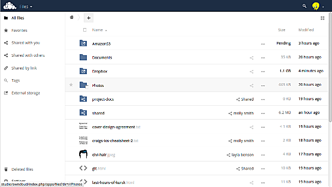
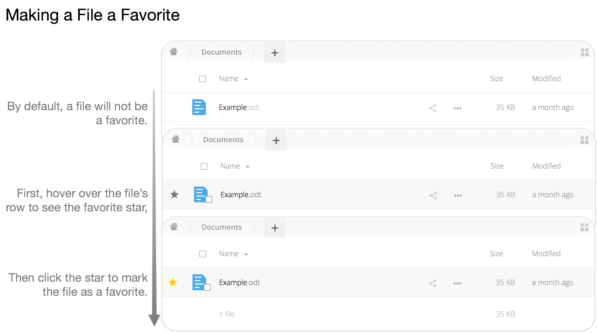
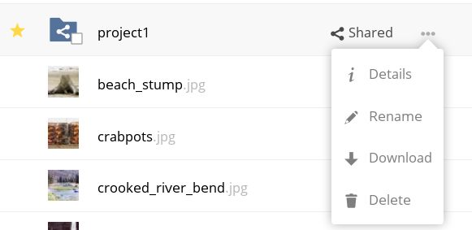
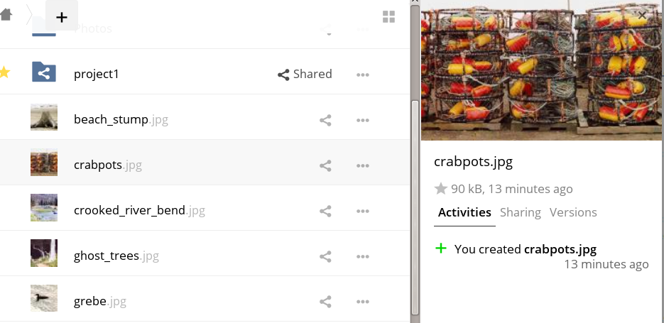

==============
WebUI Overview
==============

You can access your files with the ownCloud Web interface, as well as: *create*, *preview*, *edit*, *delete*, *share*, and *re-share* files. 

.. IMPORTANT::
   Your ownCloud administrator has the option to disable these features. If any
   of them are missing on your system ask your server administrator.

File Controls
-------------
   
When you mouseover, or hover over, a file in the Files view, as in the image
below, ownCloud displays three file controls. 
These are:

#. `Marking Favorites`_
#. `Sharing Files`_
#. `The Overflow Menu`_
  
.. figure:: ../../images/files_file-controls.png
   :alt: File controls

Marking Favorites
~~~~~~~~~~~~~~~~~

Click the star to the left of the file icon to mark it as a favorite, and
quickly find all of your favorites with the Favorites filter on the left
sidebar.
  

  
Sharing Files
~~~~~~~~~~~~~

The sharing files control is a shortcut to the file and folder sharing
functionality within ownCloud. ownCloud sharing supports:

- Sharing files and folders with users or groups 
- Creating public shares with hyperlinks 
- Listing recipients of existing shares
- Deleting existing shares 

.. _the_overflow_menu_label:

The Overflow Menu  
~~~~~~~~~~~~~~~~~

The Overflow Menu allows you to:

- `Display File Details`_ 
- Rename files
- Download files
- Delete files
  

   
Display File Details
^^^^^^^^^^^^^^^^^^^^

When you display details about a file, by clicking "Details" in the Overflow Menu, a set of tabs (or views) are available. These are:

================= =============================================================
View              Description
================= =============================================================
Details           This shows details about a file, such as its name, size, 
                  and when it was created or last updated.
Activity          This shows a history of activity on the file, such as when 
                  it was created, updated, and shared.
Sharing           It's here that shares are managed. To know more, refer to 
                  the `Sharing Files`_ section.
Version           This shows a history of all the versions of the file. This is
                  not available for folders.
================= =============================================================
  
You can see an example of the Activity view in the image below.
  

