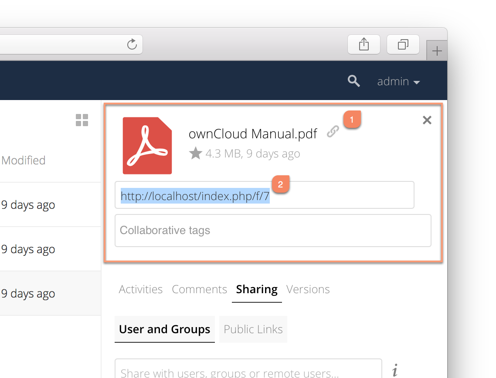

=============
Sharing Files
=============

Clicking the share icon on any file or folder opens the Details view on the
right, where the Share tab has focus. 

Sharing Status Icons
~~~~~~~~~~~~~~~~~~~~

Any folder that has been shared is marked with the ``Shared`` overlay icon. 
Public link shares are marked with a chain link. Un-shared folders are blank.

.. figure:: ../../images/files_page-5.png
   :alt: Share status icons.

If your ownCloud server is the Enterprise edition, you may also have access to
Sharepoint and Windows Network Drive file shares. These have special status
icons. An icon with a red plugin and background means you have to enter a login
to get access to the share.

.. figure:: ../../images/files_share-options.png

Creating Shares
~~~~~~~~~~~~~~~

To share a file or folder, immediately below the Share tab, you will see a text
field. In this field, you can enter any number of users (whether local to your
ownCloud server or remote) or groups who you would like to share the file or
folder with.

If username auto-completion is enabled, when you start typing the user or group
name ownCloud will automatically complete it for you, if possible.

After a file or folder has been shared, `Share Permissions`_ can be set on
it. In the image below, you can see that the directory "event-Photos" is shared
with the user "pierpont", who can *share*, *edit*, *create*, *change*, and
*delete* the directory.
  
.. figure:: ../../images/files_page-2.png
   :alt: Sharing files.

Sharing Files with Guest Users
^^^^^^^^^^^^^^^^^^^^^^^^^^^^^^

Users can also share files and folders with guest users. 
To do so, your ownCloud administrator will need to have installed the Guest application.

If it's already installed, in the "**User and Groups**" field of the Sharing panel, type the username of a user who is not already a user in your ownCloud installation.
You will then see a popup appear with the suffix ``(guest)``, as in the screenshot below.

.. image:: ../../images/guest-users/share-with-guest-users.png
   :alt: Sharing with guest users.
   
After you click the username in the list, you'll see a modal dialog appear, where you can add the new user to the list of guest users. 

.. image:: ../../images/guest-users/add-user-to-guests.png
   :alt: Add a guest user modal dialog.

The Name field will be pre-filled with the username you supplied. 
All you need to do is add the user's email address, and click "**Save and Share**".
After you do that, the content will be shared with the user with all permissions applied, except for the ability to share with other users.

.. image:: ../../images/guest-users/content-shared-with-guest-user.png
   :alt: Content shared with a guest user.

Updating Shares
~~~~~~~~~~~~~~~

To change any of the properties of a share, again, you first need to view the
Share tab. From there, you can:

- Delete a user's access to a share
- Give more users access to a share
- Change a user's share permissions
- Add or remove password protection
- Set or remove a share's expiration date

As this functionality is already described in other parts of the `Sharing
Files`_ section, it won't be specifically covered here.

Deleting Shares
~~~~~~~~~~~~~~~

Despite the name of this section, you don't actually delete a share. Rather
what you do is remove the access of user's to whom it's already been shared
with. When all users access to a shared resource has been removed, the resource
is no longer shared. 

To do that, you need to click on the rubbish bin icon, on the far right-hand
side of the name of each user it's been shared with, who should no longer have
access to it.

Password Protecting Files
~~~~~~~~~~~~~~~~~~~~~~~~~

It's also possible to password protect shared files and folders. If you want to
do so, then you need to enable this functionality. Specifically, click the
checkbox labeled "*Password protect*" under the "*Share Link*" section. 

When you do so, you'll see a password field appear. In there, add the password
that the user will need to enter to access the shared resource and press the
return key.

Using Private Links
~~~~~~~~~~~~~~~~~~~~

Another way to access a file or folder is via a private link. 
It’s a handy way of creating a permanent link for yourself or to point others to a file or folder, within a share, more efficiently. 
To access the private link, in the Sharing Panel for a file or folder, next to its name you’ll see a small link icon (1), as in the screenshot below. 

If you click it, a new textbox will appear above the "**Collaborative tags**" field, populated with the link’s URI (2). 

.. note:: 
   Only people who have access to the file or folder can use the link.

Changing The Share Expiration Date
~~~~~~~~~~~~~~~~~~~~~~~~~~~~~~~~~~

In older versions of ownCloud, you could set an expiration date on both local 
and public shares. Since the most recent version three, key, changes have been
made: 

- You can *only* set an expiration date on public shares
- Local shares do not expire when public shares expire 
- A local share can only be "expired" (or deleted) by clicking the trash can icon

Creating or Connecting to Federation Share Links
~~~~~~~~~~~~~~~~~~~~~~~~~~~~~~~~~~~~~~~~~~~~~~~~

Federated Cloud Sharing allows you to mount file shares from remote ownCloud
servers, and manage them just like a local share. In ownCloud 8 the process
for creating a new sharing link is easier and more streamlined. See
:doc:`../federated_cloud_sharing` to learn to how to create and connect to new
Federated Cloud shares.

Share Permissions
~~~~~~~~~~~~~~~~~

Shares can have a combination of the following five permission types:
 
========== ===================================================================
Permission Definition
========== ===================================================================
can share  Allows the users you share with to re-share
can edit   Allows the users you share with to edit your shared files, and to 
           collaborate using the Documents app
create     Allows the users you share with to create new files and add them 
           to the share
change     Allows uploading a new version of a shared file and replacing it
delete     Allows the users you share with to delete shared files
========== ===================================================================
   

.. _create_drop_folder_label:

Creating Drop Folders   
~~~~~~~~~~~~~~~~~~~~~

As of ownCloud version 10.0.2, users can create upload-only, public shares (otherwise known as "Drop Folders"). 
Drop Folders allow users to upload files to a central location, but don’t allow them to either see or change any existing files, which already have been uploaded.

To create one: 

#. View the sharing panel of the folder that you want to share as a Drop Folder, and under **"Public Links"** select **"Create public link"**.
#. As with other shares, provide the name in the **"Link Name"** field.
#. Check **"Allow editing"**, un-check **"Show file listing"**, and then un-check **"Allow editing"**.
#. Finally, click **"Save"** to complete creation of the share. 

Now, as with other public links, you can copy the link to the share and give it out, as and when necessary. 

Using Drop Folders
~~~~~~~~~~~~~~~~~~

.. image:: ../../images/sharing/use-drop-folders.png
   :alt: Using Drop Folders

When users open the share link, they will see a page where they can either click to select files to share, or drag-and-drop files directly to share them. 
After the file's been successfully uploaded, they’ll see (where possible) a preview of the file that has been uploaded.
   

