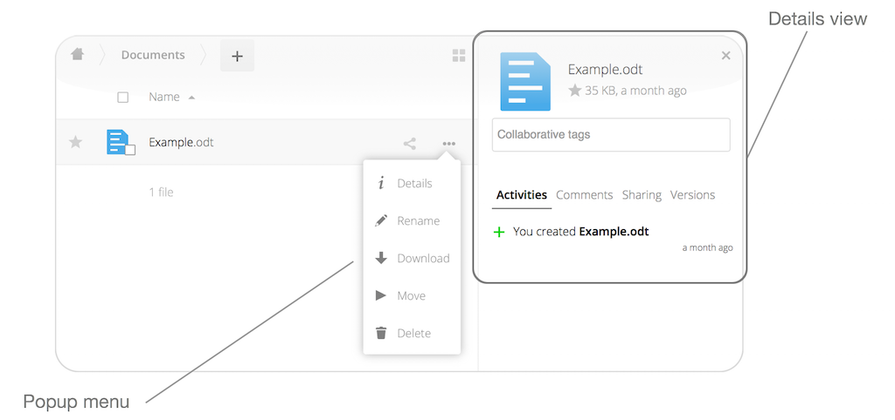
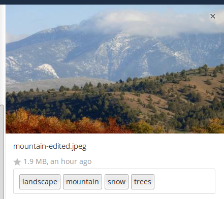
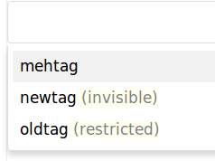

=============
Tagging Files
=============

In ownCloud, you can assign one or more tags to files and folders. To do so, go
to the "**Details**" view, inside :ref:`The Overflow Menu <the_overflow_menu_label>`. There, you'll see a text
field, with the placeholder text "**Collaborative tags**" if no tags have yet
been added, below the file's icon, name, and other details. 

In that field, type the tag's name. 
If you want to use multiple words, there is no need to use single or double-quotes. 
Type as many words as you want for the tag name. 
When you press the return key your tag will be saved.

.. NOTE::
   All tags are system tags, so they are shared by all users on your ownCloud
   server.

When you place the cursor inside the tags field, and as you type the tag name,
a list of the system tags will appear. If you type a new tag name, the visible
tags list will be filtered, based on the text that you've typed. 

If you see a tag in the list which is what you had intended to type, or is
a better fit than what you had in mind, click on it, and it will be added to the
file or folder's tag list. This can save you a lot of time and effort.

Untag a File or Folder
~~~~~~~~~~~~~~~~~~~~~~

If a file or folder is already tagged, the tag names in the popup list will have
a check mark to the left of the tag's name. To remove that tag from the file or
folder, click the tag's name. You will see that the check mark disappears.

Edit Tags
~~~~~~~~~

To edit a tag, click the pencil icon on the far right-hand side of the tag's
name, in the tags popup list. This will display a text box, containing the tag's
name. Be sure that you want to change the tag's name, as it will be updated for
all users.

Delete Tags
~~~~~~~~~~~

To delete a tag, as above, click the pencil icon on the far right-hand side of
the tag's name, in the tags popup list. Next to the text box containing the
tag's name, you will also see a delete icon. 

Click this to remove the tag from
the system tag's list. As with renaming a tag, remember that deleting a tag
removes it for all users. So please be sure that you want to do this.

Filter By Tag
~~~~~~~~~~~~~

To filter by tag, use the **Tags** filter on the left sidebar of the Files
page. There are three types of tags: 

========== ====================================================================
Tag        Description
========== ====================================================================
Visible    All users may see, rename, and apply these tags to files and folders
Restricted Tags are assignable and editable only to the users and groups which
           have permission to use them. Other users can filter files by 
           restricted tags, but cannot tag files with them or rename them. 
           The tags are marked (restricted)
Invisible  Visible only to ownCloud admins
========== ====================================================================

When you use the **Tag** filter on your Files page you'll see something like the
following image. If you do not have Admin rights then you will not see any
invisible tags.

