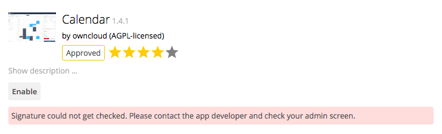

======================
Using the Calendar App
======================

The Calendar app is not enabled by default in ownCloud |version| and needs to be enabled separately. It is also not a supported core app. 
It is currently under heavy development, so documentation has moved to the `documentation Wiki on Github 
<https://github.com/owncloud/documentation/wiki/Using-the-Calendar-App-in- ownCloud-9.0>`_. 
You are welcome to add content to the Wiki document; all you 
need is a GitHub account.

The default Calendar application is not able to be enabled. 
If you attempt to enable it, you will see the following error:

To enable calendar functionality, you need to enable the Marketplace first.
To do so, add the following line to ``config/config.php``, which connects your ownCloud instance with the Marketplace.

:: 

  'appstoreurl' => 'https://marketplace.owncloud.com/api/v0',

After saving the changes, reload the ownCloud UI and enable the Calendar application.

.. note:: 
   In case you are sitting behind a firewall and cannot reach the marketplace (or if you prefer to install applications manually) you can install the Calendar app by:
  - Downloading the package from the Marketplace
  - Unpacking the tarball into the ``apps`` folder 
  - Enable the Calendar app, available under disabled apps.

.. note::
   Please also check that you disable and uninstall existing apps from the old app store **before** you installing and enabling the newer versions from the marketplace. If you do not, attempting to uninstall them displays the "*app directory already exists*" error message.
