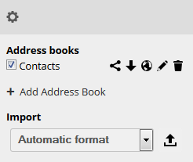
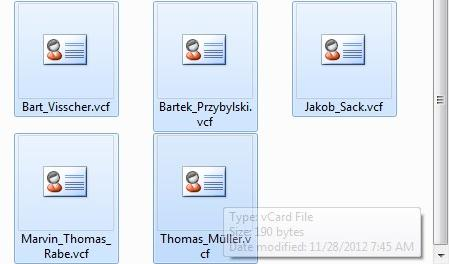
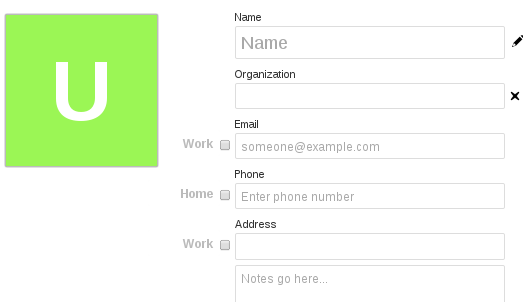
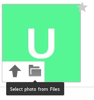
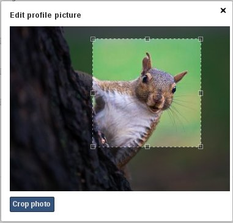
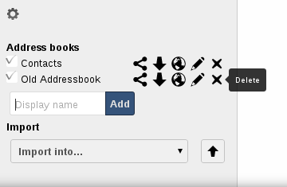
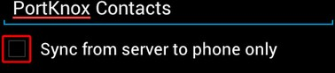

Using the Contacts App
======================

The contacts app of ownCloud is like any other mobile contact app but with more functionality.
Just as you open your account you will get the default addressbook.
We will see later how you can add and remove addressbooks.

Adding contacts
---------------
There are two ways in which you can add contacts

1. Add them manually
2. Import a VCF file

Importing
~~~~~~~~~

First we'll check out how to import all the VCF files as this is a much
faster way of creating contacts.
Just below the contact list, click on the gear button:

Contact settings icon

Once you've clicked it, an up arrow button which lets you upload files will be shown:

Contact file upload icon

After choosing an addressbook to import into, click on the arrow. The upload window will be opened and let you choose your files.
You can upload the files one by one or upload all of them in one go.

Let us demonstrate.
Open the directory in which you store all the files and perform the following steps:
Keep pressing CTRL and select the files to upload.
After you are done click the open button.
After the upload it should look something like this in which all the names and contacts are sorted alphabetically.

Picking VCF files

After upload, the interface will automatically place your contacts into ownCloud.

Create contacts manually
~~~~~~~~~~~~~~~~~~~~~~~~

On the left side of the contacts app, you can see the *New Contact* button.
After clicking on it you can see an empty contact in the main part of the interface.
You have the ability to add all your information about the contact:
the name, the address, the e-mail, the telephone number, etc.

Just click on a field and start typing the information.
You can use the "Add field..." button to add other types of information for this contact.

Empty contact view

When you want to remove an information of your contact, just click on the little trash icon
at the right of the field you want to remove.

Adding picture to the contact
~~~~~~~~~~~~~~~~~~~~~~~~~~~~~

There are two methods in which you can give a picture id to the specific contact.

Contact picture options
~~~~~~~~~~~~~~~~~~~~~~~

1) **Direct upload**
2) **Select photos already uploaded in ownCloud files.**

After you have selected the picture for the contact you get
an option to crop the picture to suit your requirements.

Cropping the contact picture

You can crop the picture as you like and then press *Crop photo*.

As you can see it is really easy to set things right in this app.
It automatically picks up the First name, Middle name (if any) and the last name.
You may add or delete any section you want for your own convenience.

Creating new addressbooks
--------------------------

When you click on the settings button on the bottom bar,
you will have access to the application's settings.
Then, you will be shown all available addressbooks to access their options.

Addressbook options

There, you have the ability to add, delete, download or share your addressbooks.
Hover your cursor on every icon to see what they mean.

Keeping your addressbooks in sync
--------------------------------

One of the most important things in any contact app is to keep it in sync.
You can sync the contact app to your Android or iOS phone.

Syncing with Android
~~~~~~~~~~~~~~~~~~~~

1) Install CardDAV-Sync free from Google play store by visiting `this link <https://play.google.com/store/apps/details?id=org.dmfs.carddav.sync>`_.
2) This app supports auto-configuration which is an advantage. After installing visit this `<carddavs://example.org/remote.php/carddav/> <carddavs://example.org/remote.php/carddav/>`_ to auto-configure the app.
3) Enter your login details
4) After the app has checked your login details you may select the *Sync server to phone* option
5) That is it. There is nothing else to do for Android!

Syncing your iOS device
~~~~~~~~~~~~~~~~~~~~~~~

Synchronizing the addressbook.

1. Open the settings application.
2. Select Mail, Contacts, Calendars.
3. Select Add Account.
4. Select other as account type.
5. Select Add CardDAV account.
6. For server, type http://example.org/remote.php/carddav/principals/username
7. Enter your user name and password.
8. Select Next.
9. If your server does not support SSL, a warning will be displayed. Select Continue.
10. If the iPhone is unable to verify the account information perform the following:

* Select OK.
* Select advanced settings.
* Make sure Use SSL is set to OFF.
* Change port to 80.
* Go back to account information and hit Save.

You should now be able to find your contacts in the addressbook of your iPhone.

Other Syncing options provided by ownCloud
~~~~~~~~~~~~~~~~~~~~~~~~~~~~~~~~~~~~~~~~~~

1. For Android you may use the official Android app which can be found `here <https://owncloud.org/install/>`_.
2. For iOS (iPhone and iPad) use their app which can be found `here <https://owncloud.org/install/>`_.

