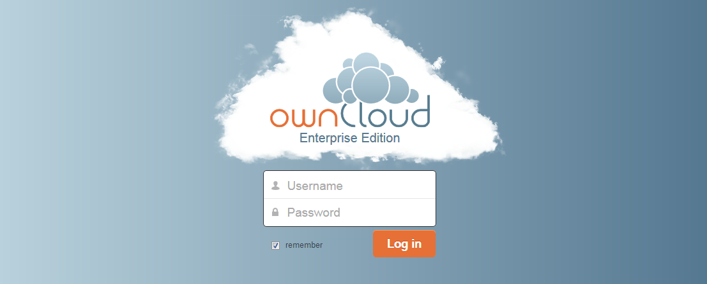
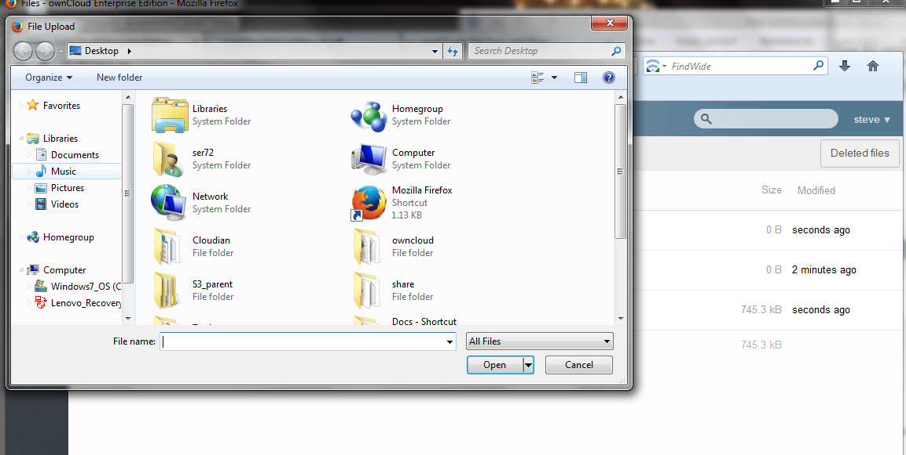
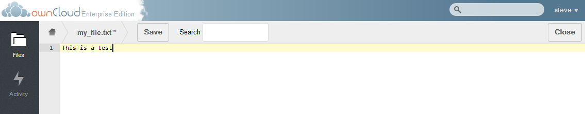
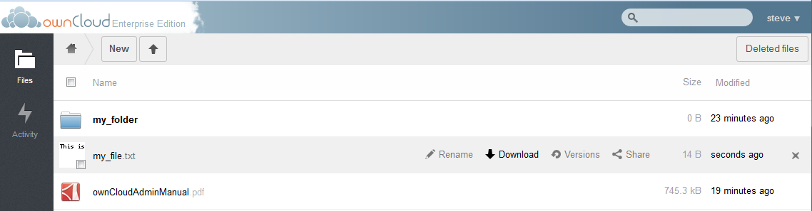
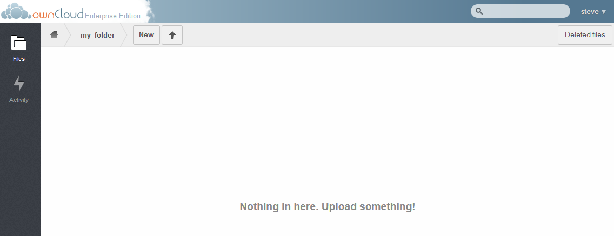
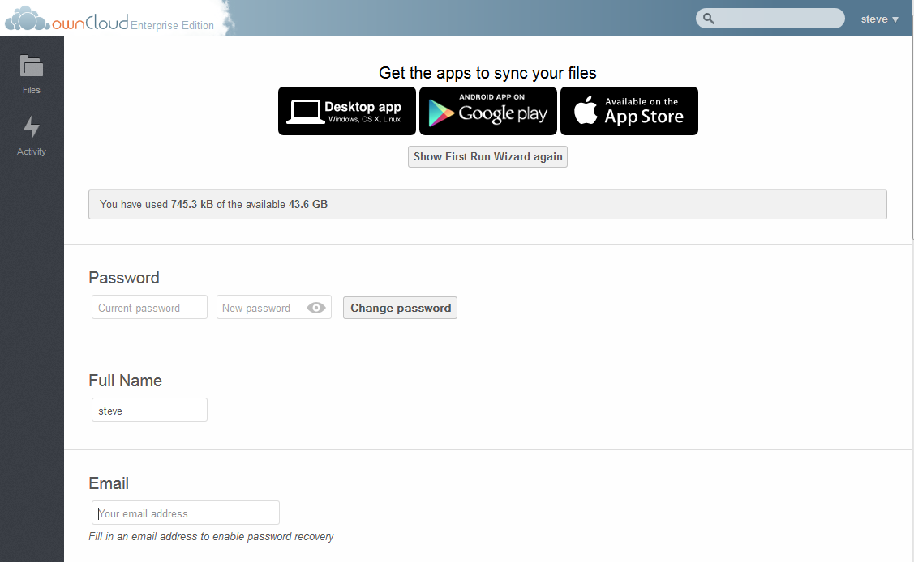
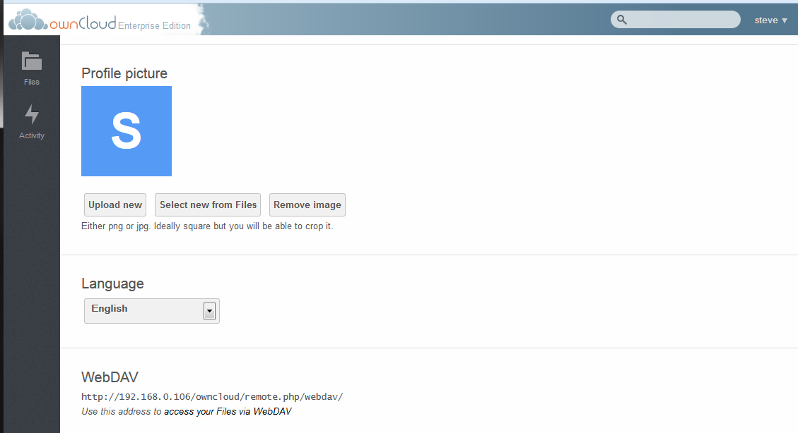

The ownCloud Web Interface
==========================

Introduction
------------

This document will discuss the ownCloud web interface from a user’s perspective.
It will detail how to log into ownCloud, upload files, create files and folders, as well as describe the Personal Page settings.
When possible, it will reference other more detailed documents on specific functionality.

Initial Log In
--------------

The ownCloud initial login screen is as follows.

|1000000000000453000001BFFCF48776_png|

It should be noted, that if the instance of ownCloud is themed differently, there will be a different logo on the screen.

To log into ownCloud, enter the username and password provided by your ownCloud admin.
To remain logged into ownCloud under the same credentials, select the checkbox next to Remember.

Upon initial login, the user will most likely see the “Welcome to ownCloud” banner as below.

|1000000000000479000002887E7F48EA_png|

This banner provides links to download the desktop sync app (see Desktop Client document), as well as the mobile apps.
This banner will appear upon the first login only, provided the admin has not disabled it.
To close the banner and start using ownCloud, select the ‘x’ in the upper right corner of the banner.

.. |1000000000000479000002887E7F48EA_png| image:: images/1000000000000479000002887E7F48EA.png
    :width: 6.5in
    :height: 3.6783in

Main ownCloud screen
--------------------

Once logged into ownCloud, the main screen will be displayed.

|100000000000047700000219A3013A92_png|

There are four sections in the main ownCloud screen

#.  This is the apps bar.
    Any user related apps will be displayed here.
    In a default enterprise edition of ownCloud, the Files app and the Activity app are listed.

#.  This section will display all data loaded into ownCloud.

#.  The home button brings the user to the home directory.
    The New button allows the user to create a file or folder, or link, and the upload arrow allows the user to upload a file.

#.  The search box allows the user to search and the user name pull^down can bring the user to the Personal page for personal configurations as well as log the user out.

.. |100000000000047700000219A3013A92_png| image:: images/100000000000047700000219A3013A92.png
    :width: 6.5in
    :height: 3.0535in

Adding Data
-----------

There are a few ways to add data to the ownCloud instance.
Files may be uploaded or text files may be created directly within ownCloud.
Folders may also be created directly within the ownCloud web interface.

Creation
^^^^^^^^

To create a file or folder, select the New button in section 3 of the main ownCloud screen.

|1000000000000163000000E9CDA84C92_png|

Create a text file
~~~~~~~~~~~~~~~~~~

Select “Text file” from the menu and enter the desired file name.

|1000000000000175000000FAB2A2B294_png|

Then press enter.

|100000000000047A000000FB86FF2A9A_png|

Notice the file has been placed in section 2 of the main ownCloud window.
Since it is an empty file, the size is “0 Bytes” and it was last modified a few seconds ago.

Create a folder
~~~~~~~~~~~~~~~

To create a folder within ownCloud, simply select “Folder” from the menu and enter the desired folder name.

|1000000000000195000000EF7E44082C_png|

Then select Enter.

Notice the folder appears in the window.

|100000000000047A0000011C6682A254_png|

Adding a file from a link
~~~~~~~~~~~~~~~~~~~~~~~~~

If the desired file exists on the internet already it is possible to add the file to ownCloud using the internet link.
To do this, select “From link” from the menu and enter the URL of the file then select enter.

|10000000000001CE000000F2E2084BA1_png|

|100000000000046D0000015F4B5494A9_png|

The file contained in the link now appears in the user’s ownCloud instance.

Uploading files
^^^^^^^^^^^^^^^

There are two methods possible to upload files to the ownCloud web interface.

Drag and Drop
~~~~~~~~~~~~~

Simply drag and drop one or more files from the client’s
Desktop into section 2 of the main ownCloud window.
These files will then be uploaded to ownCloud and appear in the data window.

Upload Button
~~~~~~~~~~~~~

The second method to upload a file to ownCloud is to select the upload arrow on the top left of the main ownCloud screen.
This will being up a File Upload selection box.

|100000000000048100000245268CDB7A_png|

Navigate to the directory containing the desired files and select the file for uploading and press Open.
To upload multiple files simultaneously, use either the SHIFT or CTRL key during file selection as appropriate.

.. |100000000000047A000000FB86FF2A9A_png| image:: images/100000000000047A000000FB86FF2A9A.png
    :width: 6.5in
    :height: 1.4228in

.. |1000000000000163000000E9CDA84C92_png| image:: images/1000000000000163000000E9CDA84C92.png
    :width: 3.698in
    :height: 2.4272in

.. |10000000000001CE000000F2E2084BA1_png| image:: images/10000000000001CE000000F2E2084BA1.png
    :width: 4.8126in
    :height: 2.5201in

.. |1000000000000195000000EF7E44082C_png| image:: images/1000000000000195000000EF7E44082C.png
    :width: 4.2189in
    :height: 2.4898in

.. |100000000000047A0000011C6682A254_png| image:: images/100000000000047A0000011C6682A254.png
    :width: 6.5in
    :height: 1.611in

.. |100000000000046D0000015F4B5494A9_png| image:: images/100000000000046D0000015F4B5494A9.png
    :width: 6.5in
    :height: 2.0138in

.. |1000000000000175000000FAB2A2B294_png| image:: images/1000000000000175000000FAB2A2B294.png
    :width: 3.8846in
    :height: 2.6043in

Navigation
----------

Changing directories
^^^^^^^^^^^^^^^^^^^^

To navigate to other folders within ownCloud, simply click on the desired folder.

|1000000000000470000001B68AE60DD3_png|

Notice that Section 3 shows the currently displayed directory “my_folder”.
To navigate back to the root directly, select the “Home” button.

Viewing/Editing files
^^^^^^^^^^^^^^^^^^^^^

ownCloud has the ability to view text files as well as pictures.
To view a text file or a picture, click on the file.

|10000000000004710000014BBC34499D_png|

For text files, a text editor will be brought up allowing the user to modify the file as desired.
Just type the desired text and select “Save” to commit the changes.
Once changes have been made to the file, prior to saving, the name of the file will have an “*” next to it indicating it has yet to be saved.

|100000000000046F000000DEA2BFCD9B_png|

Once changes have been saved, a thumbnail of the text file will appear in the main data window.

|100000000000041D0000003D52225C0D_png|

Downloading a file
^^^^^^^^^^^^^^^^^^

To download a file from ownCloud to your working computer, hover over the file and then select the “Download” button.

|100000000000047200000129CB014025_png|

For non^text or picture files, the user may also click on the file name to download it.

Renaming files or Folders
^^^^^^^^^^^^^^^^^^^^^^^^^

To rename a file or folder within ownCloud, hover over the file and select Rename.
Then type the new name of the file or folder.

Sharing, Versions, Delete, and Activity
^^^^^^^^^^^^^^^^^^^^^^^^^^^^^^^^^^^^^^^

For more information on the sharing, versions, deletion or Activity features, please see the respective documents.

.. |100000000000041D0000003D52225C0D_png| image:: images/100000000000041D0000003D52225C0D.png
    :width: 6.5in
    :height: 0.3764in

.. |10000000000004710000014BBC34499D_png| image:: images/10000000000004710000014BBC34499D.png
    :width: 6.5in
    :height: 1.8925in

Personal Configurations
-----------------------

Each ownCloud user may configure some personal preferences.
To make these configurations, navigate to the Personal page.
Select the user name and the following menu will appear.

|100000000000047A000000B727198874_png|

Select Personal to get to the configuration page.

Configuration options on this page may appear or disappear depending on what the ownCloud admin has configured.
The basic configuration parameters are as follows.

|1000000000000467000002B63162E59B_png|

|10000000000004690000026615360BEB_png|

Important links
^^^^^^^^^^^^^^^

The top section of the Personal page contains the same links as the First Run Wizard described earlier in this document.
For more information on this, see the document on the First Run Wizard.

Quota
^^^^^

Below shows the used and remaining space for the user.
For information as to how this is calculated, refer to the ownCloud Quota Calculations document.

Password Change
^^^^^^^^^^^^^^^

If the user desires to change the password, do so in this section.
Enter the current password followed by the new password and select “Change Password”.
It should be noted, that when using LDAP authentication, the password is contained within the LDAP and not locally thus this field will not change the password.

Change Display Name
^^^^^^^^^^^^^^^^^^^

To change the way your name is displayed within ownCloud, enter the desired name under “Full Name”.

Add Email Address
^^^^^^^^^^^^^^^^^

For password recovery and share notifications, it is important for ownCloud to have an email on record.
Enter the desired email address under the EMAIL section.

Avatar
^^^^^^

ownCloud allows a user to upload an Avatar for their ownCloud instance.
This can be done under the “Profile Picture” section of the Personal Page.

To upload a new Avatar, select the “Upload new” button.
If the desired avatar exists on the ownCloud file system, select “Select new from Files” and to remove the avatar and return to the default, select “Remove image”

Language
^^^^^^^^

If English is not the user’s native language, they may change the language in this section.

WebDAV
^^^^^^

This provides the address to use in order to access a user’s files via WebDav.

.. |100000000000047A000000B727198874_png| image:: images/100000000000047A000000B727198874.png
    :width: 6.5in
    :height: 1.0382in

