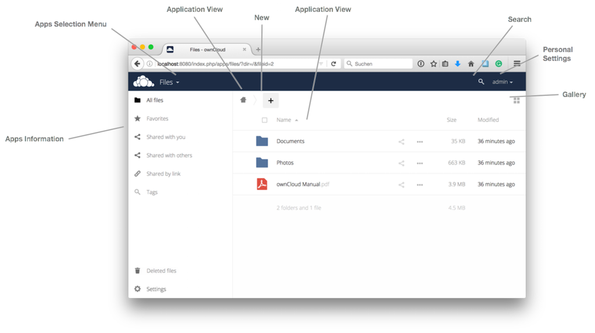

==========================
The ownCloud Web Interface
==========================

You can connect to your ownCloud server using any Web browser; navigate to 
your ownCloud server and enter your username and password. The supported web 
browsers are:

* Firefox 14+
* Chrome 18+
* Safari 5+
* IE11+ (except Compatibility Mode)

  .. figure:: images/oc_connect.png
     :alt: ownCloud login screen.

.. note:: Some settings, such as ``files_external`` and ``encryption``, disable 
   the **Stay logged in** checkbox.

Navigating the Main User Interface
----------------------------------

By default, the ownCloud web interface lists all your files. 
Here, you can add, remove, and share files, 
as well as make changes based on the access privileges 
which you set (if you are administering the server) or by your server administrator.

The ownCloud user interface, which you can see above, contains the following elements:

* **Apps Selection Menu**: Located in the upper left corner, click the arrow to 
  open a dropdown menu to navigate to your various available apps
  
* **Apps Information**: Located in the left sidebar, this provides 
  filters and tasks associated with your selected app
  
.. note:: For example, when you are using the Files apps, you have a special set of filters 
   for quickly finding your files. These include filtering on files that have been shared with you, 
   and files that you have shared with others. You'll see different items for other apps.

* **Application View**: The main field in the ownCloud user interface.
  This field displays the contents, or user features, of your selected app

* **Navigation Bar**: Located over the main viewing window (the Application
  View), this bar provides a type of breadcrumb navigation that enables you to
  migrate to higher levels of the folder hierarchy, 
  all the way up to the root level (home)

* **New button**: Located in the Navigation Bar, the ``New`` button
  enables you to create new files, folders, and upload files

.. note:: You can also drag and drop files from your file manager into the 
   ownCloud Files Application View to upload them to ownCloud. Currently, 
   the only web browsers that support drag-and-drop folders are Chrome and 
   Chromium

* **Search field**: Click on the magnifier in the upper right hand corner of 
  to search for files
  
* **Gallery button**. This looks like four little squares, and takes you 
  directly to your image gallery   

* **Personal Settings Menu**: Click on your ownCloud username, located to the 
  right of the Search field, to open your Personal Settings dropdown menu. Your 
  Personal page provides the following settings and features:

  * Links to download desktop and mobile apps
  * Re-run the First Run Wizard
  * Server usage and space availability
  * Password management
  * Name, email, and profile picture settings
  * Manage connected browsers and devices
  * Group memberships
  * Interface language settings
  * Manage notifications
  * Federated Cloud ID
  * Social media sharing buttons
  * SSL certificate manager
  * ownCloud Version information

See :doc:`userpreferences` section to learn more about these settings.
